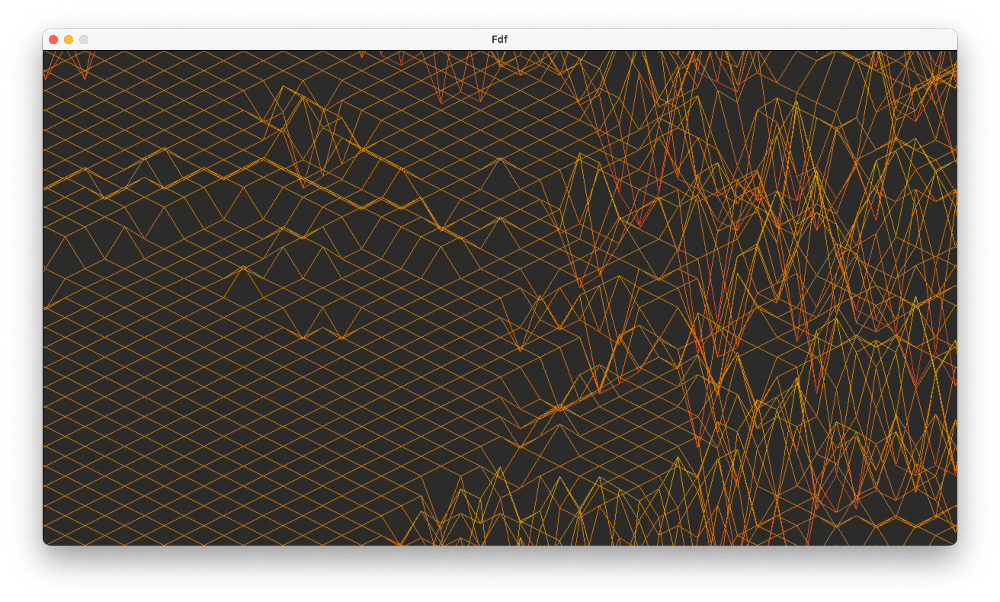

_This is a **21 School/Ecole 42** Project_

# Fdf

Fdf is a program that creates simplified 3D graphic representation of a relief landscape using [MiniLibX](https://harm-smits.github.io/42docs/libs/minilibx/introduction.html) library. Subject can be found [here](https://cdn.intra.42.fr/pdf/pdf/47326/en.subject.pdf).

FDF is short for ’fil de fer’ in French which means ’wireframe model’.

## Project goals

* Create a basic computer graphics project
* Learn about mapping
* Drawing lines in 3D using maths
* Implement axis rotation, zoom and transmittion


## To compile and run
Run the following commands in Terminal:
```shell
# to build
> make

# to run
> ./fdf test_maps/pentenegpos.fdf
```

The program accepts a map in `.fdf` file as argument. Those files can be found at `test_maps/` folder. Those include lines of numbers separated by spaces (sometimes with HEX colour codes) representing height of the points on map.

To close window press `esc`.

## Scene control

Use `[+]` & `[-]` to zoom in and out

Use `[1]` & `[2]` to rotate on x-axis

Use `[3]` & `[4]` to rotate on y-axis

Use `[5]` & `[6]` to rotate on z-axis

Press `[↑]` to move upwards

Press `[↓]` to move downwards

Press `[←]` to move left

Press `[→]` to move right

## Reneder examples




